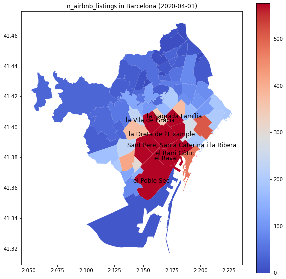

# Rent prediction in Barcelona

👉  [Data Analytics CodeOp Course](https://codeop.tech/data-analytics-bootcamp/) Final Project, by [Vivian Kim](https://github.com/vivian-kim) and [Antonia Villarino](https://github.com/AntoniaVillarino) 

- *See the [slides](https://docs.google.com/presentation/d/1V_0Ko-ZDkXAUzql9iJNp_9b7z4t-Qx8tL7JxGDCCZ2U/edit?usp=sharing) for the final presentation.*

## 1. Aim of the project

Our main goals in this project are:

1. to forecast the rent price per neighbourhood in Barcelona.
2. fo find if there is any impact of Airbnb on Barcelona's renting price.

## 2. Some background

Barcelona's rental prices have been on the rise since 2013, with a higher increase since early 2015. From the first quarter of 2014 (647.46 €) to the last quarter of 2019 (the maximum of the series, 937.56 €), rental prices have increased by 44.81%, [while the medium salary increased by 0.08%](https://www.bcn.cat/estadistica/castella/dades/ttreball/salaris/evo/C1006010.htm)

There are [a lot of factors involved](https://www.mdpi.com/2071-1050/10/6/2043) in this increase, such as the unattainable prices of the housing market and real estate speculator companies. Short term rental platforms like Airbnb detract homes from the long-time market, and we want to find out it his has a noticeable impact on Barcelona's rental prices.

## 3. Raw data

We used 3 different sources of data:

- [Barcelona's rent prices](https://opendata-ajuntament.barcelona.cat/data/en/dataset/est-mercat-immobiliari-lloguer-mitja-mensual), from [OpenDataBCN](https://opendata-ajuntament.barcelona.cat/en/). This dataset has quarterly data from January 2014 to April 2020
- [Airbnb](https://www.airbnb.com/) Data, collected by [Inside Airbnb](http://insideairbnb.com/index.html). We downloaded quarterly data for Barcelona, from April 2015 to January 2021.
- Extra Population Data ([unemployment](https://opendata-ajuntament.barcelona.cat/data/en/dataset/est-atur-durada), [educational levels](https://opendata-ajuntament.barcelona.cat/data/en/dataset/est-padro-nivell-academic-sexe) and [nationality](https://opendata-ajuntament.barcelona.cat/data/en/dataset/est-padro-domicilis-nacionalitat-espanyola-estrangera) of the population), also downloaded from [OpenDataBCN](https://opendata-ajuntament.barcelona.cat/en/).

We keep the data between 01.01.2015 and 01.10.2020

## 4. Data Wrangling

- We got data from different sources that we had to merge (see [merge_all_datasets.ipynb](https://github.com/AntoniaVillarino/renting_airbnb_barcelona/blob/main/merge_all_datasets.ipynb)). But first, we needed to summarize some variables using pivot tables (see [rent_prices_dataset_cleaning.ipynb](https://github.com/AntoniaVillarino/renting_airbnb_barcelona/blob/main/rent_prices_dataset_cleaning.ipynb), [airbnb_dataset_cleaning.ipynb](https://github.com/AntoniaVillarino/renting_airbnb_barcelona/blob/main/airbnb_dataset_cleaning.ipynb) and [academic_level_dataset_cleaning.ipynb](https://github.com/AntoniaVillarino/renting_airbnb_barcelona/blob/main/academic_level_dataset_cleaning.ipynb)). We also reduced the number of categories of some of the variables (see [Timeseries_2.ipynb](https://github.com/AntoniaVillarino/renting_airbnb_barcelona/blob/main/Timeseiries_2.ipynb), [XGBoost_model.ipynb](https://github.com/AntoniaVillarino/renting_airbnb_barcelona/blob/main/XGBoost_model.ipynb) and [prophet_model.ipynb](https://github.com/AntoniaVillarino/renting_airbnb_barcelona/blob/main/prophet_model.ipynb))
- We used [KNNImputer](https://scikit-learn.org/stable/modules/impute.html#knnimpute), from [scikit-learn](https://scikit-learn.org/stable/), to impute the Null values

## 5. A look at the data (EDA)

The behaviour of the variables by neighbourhood and over time can be seen in the [variables_visualization.ipynb](https://github.com/AntoniaVillarino/renting_airbnb_barcelona/blob/main/variables_visualization.ipynb) notebook (please, use this [nbviewer link](https://mybinder.org/v2/gh/AntoniaVillarino/renting_airbnb_barcelona/main?filepath=variables_visualization.ipynb) to see the interactive graphs online)

### 5. 1. Rental prices:

After looking our maps and plots of the data, our conclusions are:

- The rental prices behave diferently from neighbourhood to neighbourhood, being Pedralbes the most expensive and la Marina del Prat Vermell the least expensive.
- Center area has noticeable growth (40%-50%) in rent price (el Raval, la Dreta de l'Eixample, la Sagrada Família, el Barri Gòtic)

### 5. 2. Airbnb Housings:

- Just before the COVID-19 pandemic hit, the number of Airbnb rentals from April 2015 had grown by 71%.
- The number of offered Airbnb flats, like rental prices, depends a lot on the neighbourhood. This map for the second quarter of 2020 shows that the most impacted neighbourhoods are those in the city centre, like la Dreta de l’Eixample, el Raval or el Barri Gòtic. In those neighbourhoods, the ratio of Airbnb houses vs. long-term rental houses can [go from 10% to 30%](https://www.uvic.cat/en/news/a-study-by-the-dam-research-group-examines-the-massive-increase-in-airbnb-accommodation-in)

### 5. 3. Other population data:

- All the other variables have been on the rise since 2015, except for the unemployment (that goes down until the COVID-19 pandemic), and households with 2 Spanish and more, that are descending in almost every neighbourhood.
- Most educated people live in the same neighbourhoods with higher rent prices. On the contrary, the neighbourhoods with higher ratios of long-term unemployment are those in the periphery.

## 6. Models

As many neighbourhoods had similar trends, we selected 4 neighbourhoods as a sample group to test our models. The 4 selected neighbourhoods are la Dreta de l'Eixample, la Sagrada Família, el Barri Gòtic and Pedralbes. The last neighbourhood, Pedralbes, is the one with the highest rental price, while the other neighbourhoods are located in the city centre, where the rental prices increased by 40%.

We tried three different models:

### 6.1. ARIMA

The code for this model can be seen in the [Timeseries_2.ipynb](https://github.com/AntoniaVillarino/renting_airbnb_barcelona/blob/main/Timeseiries_2.ipynb) notebook (we used the [statsmodels](https://www.statsmodels.org/stable/index.html) library), and our conclusions are:

- The neighbourhood that is located in the Centre (*El Barri Gòtic*) represents the other centrally located 2 neighbourhoods as well ( *la Sagrada Família* or *la Dreta de l’Eixample*), as they have similar trends and seasonality. Since we did not add any additional features, and handle the pricing data only, this assumption can be applied to the neighbourhoods that are located in the centre.
- Two neighbourhoods behave clearly differently: the price of the centre-located neighbourhood is expected to go down in the following quarters, on the other hand, the rental price of the neighbourhood that has the highest rent price will keep increasing until it goes down again.

### 6.2. XGBoost with added time-related features

The code for the XGBoost model can be seen in the [XGBoost_model.ipynb](https://github.com/AntoniaVillarino/renting_airbnb_barcelona/blob/main/XGBoost_model.ipynb) notebook (we used the [xgboost](https://xgboost.readthedocs.io/en/latest/) library), and our conclusions are:

- The predictions of the XGBoost model are more accurate for the first half of the year(2 quarters)
- For *el Barri Gòtic*, the most tourist neighbourhood, the most important features in the model are those related to Airbnb. For the other neighbourhoods, the most important features are of mixed origins: unemployment, Airbnb data, nationality of the households.
- This model is not very accurate, but is fast and easy, and could be a quick solution for big datasets.

### 6.3. Prophet:

The code for the Prophet model can be seen in the [prophet_model.ipynb](https://github.com/AntoniaVillarino/renting_airbnb_barcelona/blob/main/prophet_model.ipynb) notebook (we used [prophet](https://facebook.github.io/prophet/) and [neuralprophet](https://neuralprophet.com/) libraries), and our conclusions are:

- The forecast for the 4 neighbourhoods we picked improved by adding at least one extra regressor related to ‘AirBnB features’, and touristic areas, like *Sagrada Família* or *el Barri Gòtic*, improve with more than 2.

## 7. General conclusions and next steps

### Conclusions:

- The results vary from neighbourhood to neighbourhood.
- Variables extracted from [Inside Airbn](http://insideairbnb.com/index.html) improve the accuracy of the model.
- We can reasonably predict the evolution in the rent prices for the next half year.

### Next steps:

- We need more granular data ([monthly](https://www.fotocasa.es/indice/#/filter/eyJ0cmFuc2FjdGlvbiI6ImJ1eSJ9) instead of quarterly)
- Search for other data that can influence the rental prices, like:
    - Vacant rental properties
    - Purchases from vulture funds
    - Mean income of neighbourhoods
    - Housing sales price statistics
